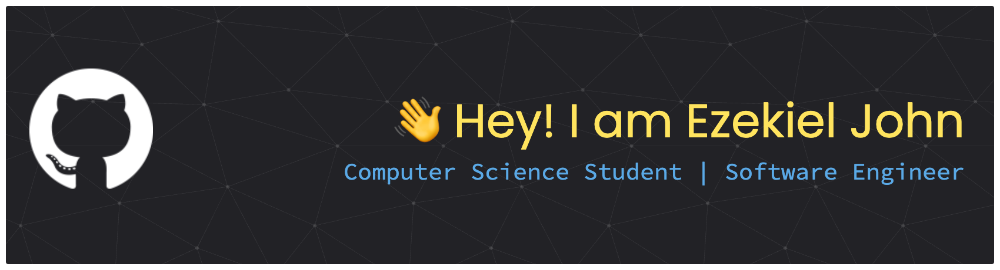

[//]: <> (<div id="user-content-toc">)
[//]: <> (<ul align="center" style="list-style: none;">)
[//]: <> (<summary style="color: #FFD670;">)
[//]: <> (<h1>Hi 👋 I'm Ezekiel John</h1>)
[//]: <> (</summary>)
[//]: <> (</ul>)
[//]: <> (</div>)


[](https://holopin.io/@alvarezekiel19)

[//]: <> (<p align="center">)
[//]: <> (<a href="https://git.io/typing-svg">)
[//]: <> ( (src="https://readme-typing-svg.demolab.com?font=JetBrains+Mono&size=26&pause=1000&color=FFD670&repeat=false&width=920&height=72&lines=Computer+Science+Student+|+Software+Engineer+%7C+UI+Designer")
[//]: <> (alt="Typing SVG" />)
[//]: <> (</a>)
[//]: <> (</p>)

---

## 👨🏻‍💻 More About Me

🎓 Computer Science student from the Philippines, focusing on **software engineering**.

⚡ Passionate about **building practical applications** and **full-stack development**.

🚗 Outside coding, I’m into **automotive engineering, motorsports, and photography**.

🐾 I love cats 🐱 and Otters 🦦

---

### ⚙ My Tech Stack

<p align="center">
  <a href="https://skillicons.dev">
    
  </a>
</p>

### 🧰 What App & Tools I Use

<p align="center">
  <a href="https://skillicons.dev">
    
  </a>
</p>

---

### 🔌 Socials

<div align="center">
  <a href="https://www.linkedin.com/in/ejalvar/" target="_blank">
    
  </a>
  <a href="https://www.instagram.com/zeee_991.2/" target="_blank">
    
  </a>
  <a href="https://dev.to/prgmrej19" target="_blank">
    
  </a>
</div>

---

|  |  |
| :------------------------------------------------------------------------------------------------------------------------------------------------------------: | :--------------------------------------------------------------------------------------------------------------------------------------------------------------------------: |
|                                                |                                                             |

<!--START_SECTION:waka-->
**I'm a Night 🦉** 

```text
🌞 Morning                143 commits         ████░░░░░░░░░░░░░░░░░░░░░   15.96 % 
🌆 Daytime                211 commits         ██████░░░░░░░░░░░░░░░░░░░   23.55 % 
🌃 Evening                414 commits         ████████████░░░░░░░░░░░░░   46.21 % 
🌙 Night                  128 commits         ████░░░░░░░░░░░░░░░░░░░░░   14.29 % 
```
📅 **I'm Most Productive on Wednesday** 

```text
Monday                   154 commits         ████░░░░░░░░░░░░░░░░░░░░░   17.19 % 
Tuesday                  151 commits         ████░░░░░░░░░░░░░░░░░░░░░   16.85 % 
Wednesday                196 commits         █████░░░░░░░░░░░░░░░░░░░░   21.88 % 
Thursday                 176 commits         █████░░░░░░░░░░░░░░░░░░░░   19.64 % 
Friday                   129 commits         ████░░░░░░░░░░░░░░░░░░░░░   14.40 % 
Saturday                 38 commits          █░░░░░░░░░░░░░░░░░░░░░░░░   04.24 % 
Sunday                   52 commits          █░░░░░░░░░░░░░░░░░░░░░░░░   05.80 % 
```


📊 **This Week I Spent My Time On** 

```text
💬 Programming Languages: 
TypeScript               1 hr 43 mins        ██████████████████████░░░   89.60 % 
JavaScript               9 mins              ██░░░░░░░░░░░░░░░░░░░░░░░   08.34 % 
JSON                     1 min               ░░░░░░░░░░░░░░░░░░░░░░░░░   01.40 % 
Markdown                 0 secs              ░░░░░░░░░░░░░░░░░░░░░░░░░   00.30 % 
CSS                      0 secs              ░░░░░░░░░░░░░░░░░░░░░░░░░   00.22 % 

🔥 Editors: 
Neovim                   1 hr 55 mins        █████████████████████████   100.00 % 

💻 Operating System: 
Mac                      1 hr 55 mins        █████████████████████████   100.00 % 
```

**I Mostly Code in C** 

```text
C                        4 repos             ███░░░░░░░░░░░░░░░░░░░░░░   13.33 % 
Jupyter Notebook         4 repos             ███░░░░░░░░░░░░░░░░░░░░░░   13.33 % 
TypeScript               2 repos             ██░░░░░░░░░░░░░░░░░░░░░░░   06.67 % 
Astro                    1 repo              █░░░░░░░░░░░░░░░░░░░░░░░░   03.33 % 
Shell                    1 repo              █░░░░░░░░░░░░░░░░░░░░░░░░   03.33 % 
```


**Timeline**


<!--END_SECTION:waka-->

---
